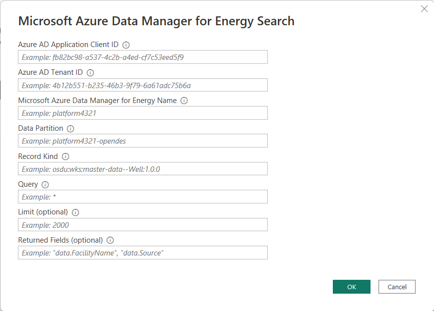

# Microsoft Azure Data Manager for Energy

## Summary

| Item | Description |
| ---- | ----------- |
| Release State | Preview |
| Products | Power BI (Datasets) |
| Authentication Types Supported | Organizational Account |
| Function Reference Documentation | &mdash; |

## Prerequisites

* [An instance of Azure Data Manager for Energy deployed to Azure](https://learn.microsoft.com/azure/energy-data-services/quickstart-create-microsoft-energy-data-services-instance)
* [Data ingested to Azure Data Manager for Energy](https://learn.microsoft.com/azure/energy-data-services/tutorial-manifest-ingestion)
* [Proper entitlements/roles to query data](https://community.opengroup.org/osdu/platform/system/search-service/-/blob/release/0.15/docs/tutorial/SearchService.md#search-api-access)

* A configured Azure AD Application with a Single-Page Application (SPA) redirect URI

    1. Navigate to the Azure AD Application used with the Azure Data Manager for Energy in the Azure Active Directory section of the Azure portal

    2. Go to the Authentication panel and add a SPA platform if one is not already created

        > [!IMPORTANT]
        > The connector will not work with a web platform.

    3. Add the following redirect URI `https://oauth.powerbi.com/views/oauthredirect.html`

        

    4. Save your changes

## Power BI Capabilities supported

* Import

## Importing the Connector to Power BI

1. Download the latest connector file (.mez) from [Releases](https://github.com/microsoft/azure-data-manager-for-energy-power-bi-connector/releases)

2. Follow [Allow Uncertified Connectors in Power BI Desktop](https://learn.microsoft.com/power-bi/connect-data/desktop-connector-extensibility#custom-connectors)

> [!IMPORTANT]
> You may not see the connector if you downloaded Power BI from the Microsoft Store. Use the [installer](https://www.microsoft.com/download/details.aspx?id=58494) instead

> Make sure you place the connector in the correct users folder. If you are using OneDrive you may have two documents folder, but C:\Users\\*username*\Documents is the correct one.

## Connect to Azure Data Manager for Energy from Power Query Desktop

To connect to **Azure Data Manager for Energy**

1. In the **Home** ribbon, select **Get Data**.

2. Select **Azure** from the list of data categories.

3. Select **Microsoft Azure Data Manager for Energy (Beta)**.

    

4. In the dialog that appears, enter the following fields:

    

    1. **Azure AD Application Client ID**

        The ID of the Azure AD Application used to create the Azure Data Manager for Energy instance

        

    2. **Azure AD Tenant ID**

        The ID of the Azure AD tenant the Azure AD Application belongs to

    3. **Azure Data Manager for Energy Name**

        The name of the Azure Data Manager for Energy instance to query data from

        

    4. **Data Partition**

        The ID of the Azure Data Manager for Energy data partition

        

    5. **Record Kind**

        The kind of record to query

    6. **Query**

        Query string based on Lucene query string syntax

    7. **Limit (optional)**

        The maximum number of records to return

    8. **Returned Fields (optional)**

        The record fields to return

    9. Select **OK** and sign in when prompted

5. Select the data table and select **Transform Data**

    

6. Transform the data

    1. Navigate to the **Records** table by selecting **Table**

        

    2. Expand the **Records** column by selecting the **expand button** in the column header, select the desired fields, and select **OK**

        

    3. Repeat column expansion until you've reached the desired data

7. Select **Close & Apply**

8. Build reports

## Support

For help, feature requests, and questions about using this project, please open an [issue](https://github.com/microsoft/Energy-Data-Services-Power-BI-Connector/issues/new) against the Github repository.