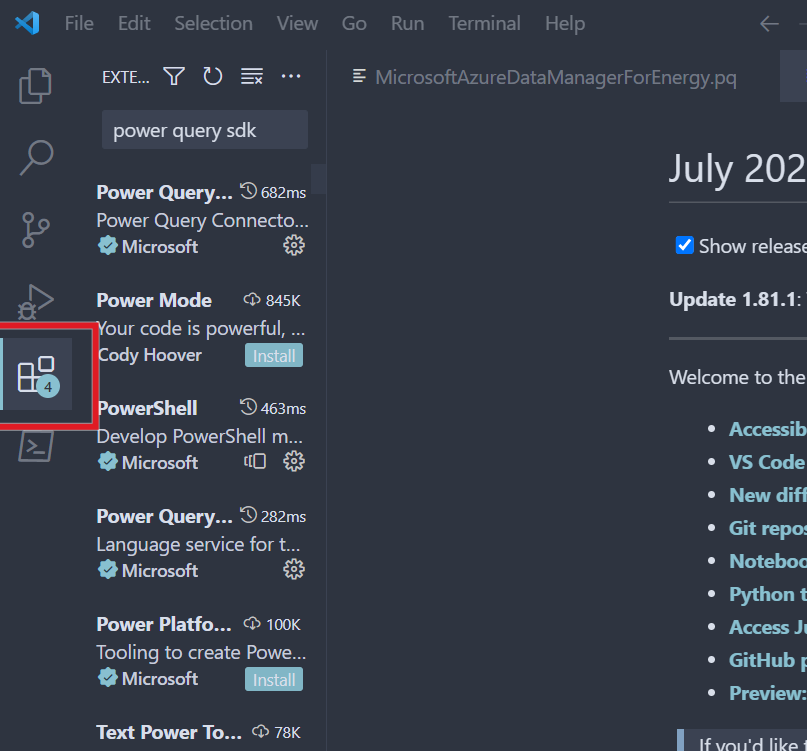

# Microsoft Azure Data Manager for Energy Power BI Connector

## About

This project is the Microsoft Azure Data Manager for Energy Power BI connector. The connector is used to query data from a Azure Data Manager for Energy instance and display it in Power BI reports.

## Using the Connector

Follow [Setup](./Documentation/Setup.md) for steps on using the connector. For developing & contributing to the connector follow the steps starting at [Development Machine Setup](#development-machine-setup).

## Development Machine Setup

1. Ensure you have [VSCode Installed]("https://code.visualstudio.com")
   
2. Go to the extensions menu option and search "Power Query SDK"
   


3. Install Extension
4. Open the folder below in VSCode
   ``` 
   /MicrosoftAzureDataManagerForEnergy/MicrosoftAzureDataManagerForEnergy
   ``````
   ensuring you are in the sub-directory where the connector pq/.mproj files are located
5. In the bottom right, a Power Query SDK mechanism will trigger after the project files are completed.  Click "Enable" to complete the SDK setup


4. [Power Query SDK Quickstart](https://learn.microsoft.com/en-us/power-query/power-query-sdk-vs-code)

## Testing the Connector

To test the connector you must configure your Azure Data Manager for Energy instance, and connector first.

### Configuring Azure Data Manager for Energy

Add the below URI as a Single Page Application (SPA) redirect URI to your AD Application

    https://oauth.powerbi.com/views/oauthredirect.html

### Configuring the Connector

Provide a client ID, tenant ID, Azure Data Manager for Energy instance name, and data partition ID in [MicrosoftAzureDataManagerForEnergy.query.pq](./MicrosoftAzureDataManagerForEnergy/MicrosoftAzureDataManagerForEnergy/MicrosoftAzureDataManagerForEnergy.query.pq). Once this is done, you can run the connector by pressing the Run button or F5.

### Using the Sample Report

There is a sample template report that can be used to test your connection. The connection details need to be updated with the following steps:

1. Open [Microsoft Azure Data Manager for Energy Wells Template.pbit](./Reports/Microsoft%20Azure%20Data%20Manager%20for%20Energy%20Wells%20Template.pbit)
1. Close the authentication prompt
1. Close the error dialog
1. Edit the 'Wells' query
1. Edit the 'Source' step
1. Input your client ID, tenant ID, Azure Data Manager for Energy instance name, and data partition ID
1. Click 'OK'
1. Click 'Close & Apply'

## Architecture

There are several pieces of the connector that warrant explanation: authentication, paging, and unit tests

### Authentication

The connector makes use of [Proof Key for Code Exchange (PKCE)](AdjustPageSizeDependingOnUsersLimit) to handle OAuth authentication. PKCE gets rid of the need for client secrets, and instead uses code challenges and verifiers. The Azure AD application needs to be configured with a Single Page Application (SPA) authentication platform to support PKCE - Web authentication platforms do not support PKCE. More information can be found in the [RFC](https://www.rfc-editor.org/rfc/rfc7636).

#### Redirect URI

The `redirectUri` variable can be any valid URI as long as the Azure AD Applications redirect URI matches it. However, for the connector to support on-premises data gateways, the `redirectUri` must be 'https://oauth.powerbi.com/views/oauthredirect.html'. More information can be found at [Handling Gateway Support](https://learn.microsoft.com/power-query/handlinggatewaysupport), [OAuth and Power BI](https://learn.microsoft.com/power-query/samples/github/readme#oauth-and-power-bi), and [Handling Gateway Support page does not specify that you need a specific redirect URI for the gateway to work](https://github.com/MicrosoftDocs/powerquery-docs/issues/284).

### Paging

Azure Data Manager for Energy only returns a maximum of 1000 records from [query_with_cursor](https://community.opengroup.org/osdu/platform/system/search-service/-/blob/master/docs/tutorial/SearchService.md#query-with-cursor). To get around this limitation, the connector uses the [Table.GenerateByPage](https://learn.microsoft.com/power-query/helperfunctions#tablegeneratebypage) helper method to retrieve all records. More information can be found on [Handling Paging](https://learn.microsoft.com/power-query/handlingpaging).

#### Paging Behavior

The logic that determines when to stop fetching pages is contained in `RetrievedAllPages`. This function will continue to retrieve pages until all items have been retrieved, or the user's optional limit is met.

#### Page Size

The default page size is 100 items, but it can be configured by adjusting the `pageSize` variable. There are scenarios where the `pageSize` needs to be adjusted, which is handled in `AdjustPageSizeDependingOnUsersLimit`. The `pageSize` will be reduced if a user provides a limit and it's less than the `pageSize`.

The query_with_cursor API does not respect changing `limits` (i.e. it will use whatever limit was specified when the cursor was created). If the final page size needs to be reduced to satisfy a user's limit, then logic in `GetSubsetOfRecordsIfNecessary` will keep only a subset of records from the final page.

### Unit Tests

There are a handful of unit tests in the project that leverage the [unit test helper code](https://github.com/microsoft/DataConnectors/blob/master/samples/UnitTesting/UnitTesting.query.pq). You'll need to authenticate & set credentials twice before running the tests, this is because there are tests with differing query parameters. The unit tests will fail to run if you change the kind parameter. The unit tests will need refactoring to handle different kind parameters.

## Possible Features for the Future

The connector supports basic search functionality, but there are some areas of improvement:

### Support all search API arguments

The Search API has a number of parameters to it: kind, query, offset, limit, sort, queryAsOwner, spatialFilter, trackTotalCount, aggregateBy, and returnedFields. The connector could be extended to support sort, queryAsOwner, spatialFilter, trackTotalCount, and aggregateBy. It currently makes use of kind, query, offset, limit, and returnedFields.

### Improve returnedRecords format

Passing values to the returnedFields parameter is not the most user-friendly since each field needs to be enclosed in quotes (e.g. "data.FacilityName", "data.Source"). The connector could be modified to automatically add quotations around each field if the user doesn't include them.

## Contributing

This project welcomes contributions and suggestions.  Most contributions require you to agree to a
Contributor License Agreement (CLA) declaring that you have the right to, and actually do, grant us
the rights to use your contribution. For details, visit https://cla.opensource.microsoft.com.

When you submit a pull request, a CLA bot will automatically determine whether you need to provide
a CLA and decorate the PR appropriately (e.g., status check, comment). Simply follow the instructions
provided by the bot. You will only need to do this once across all repos using our CLA.

This project has adopted the [Microsoft Open Source Code of Conduct](https://opensource.microsoft.com/codeofconduct/).
For more information see the [Code of Conduct FAQ](https://opensource.microsoft.com/codeofconduct/faq/) or
contact [opencode@microsoft.com](mailto:opencode@microsoft.com) with any additional questions or comments.

## Trademarks

This project may contain trademarks or logos for projects, products, or services. Authorized use of Microsoft
trademarks or logos is subject to and must follow
[Microsoft's Trademark & Brand Guidelines](https://www.microsoft.com/en-us/legal/intellectualproperty/trademarks/usage/general).
Use of Microsoft trademarks or logos in modified versions of this project must not cause confusion or imply Microsoft sponsorship.
Any use of third-party trademarks or logos are subject to those third-party's policies.
